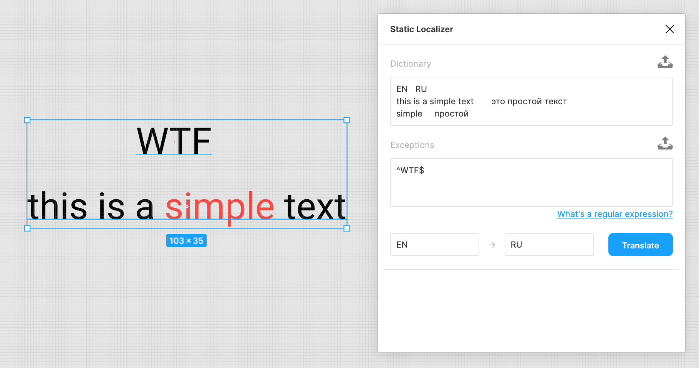

# Static Localizer

A simple Figma plugin that allows you to translate texts using a static dictionary.

It gracefully handles mixed text formatting.

## Installation

To install the plugin locally, download this repo, then go to

    Plugins > Development > Create new plugin

in Figma Desktop, and select the downloaded `manifest.json` file.

## Usage

- Select components to localize
- Invoke this plugin
- Specify a [dictionary](#Dictionary) explicitly or load it from a file
- Specify [exceptions](#Exceptions) explicitly or load them from a file
- Specify source and target language codes
- Hit `Translate`

The plugin will always remember the last used settings.




### Dictionary

Should be in the [TSV](https://en.wikipedia.org/wiki/Tab-separated_values) format.
The first row is a header containing language codes.
Each of the following rows contains translations of some phrase into corresponding languages.

For instance,
```
RU	EN	DE
Привет!	Hello!	Hallo!
день	day	Tag
```

### Exceptions

Define patterns to ignore during translation.
There should be one regular expression per line.

For instance,
```
^$
^-?[0-9. ]+%?$
```

Here are some commonly used patterns:

| Pattern | Description |
| - | - |
| `^$` | an empty text |
| `^\s*$` | whitespaces |
| `^[+-]?[0-9.,]+%?` | decimal numbers and percentages |
| `^Joom$` | some brand name |

Also, check out this [tutorial on regular expressions](https://medium.com/factory-mind/regex-tutorial-a-simple-cheatsheet-by-examples-649dc1c3f285).

## Troubleshooting

If localization fails, you will see the list of untranslatable nodes right in the UI.
For each untranslatable node we provide
- a hyperlink to it
- a translation error description

The plugin will also suggest a list of phrases that should be translated in order to complete the localization.

## Development

Just follow this guide: https://www.figma.com/plugin-docs/setup/.

# License

**Static Localizer** is released under the MIT license.
