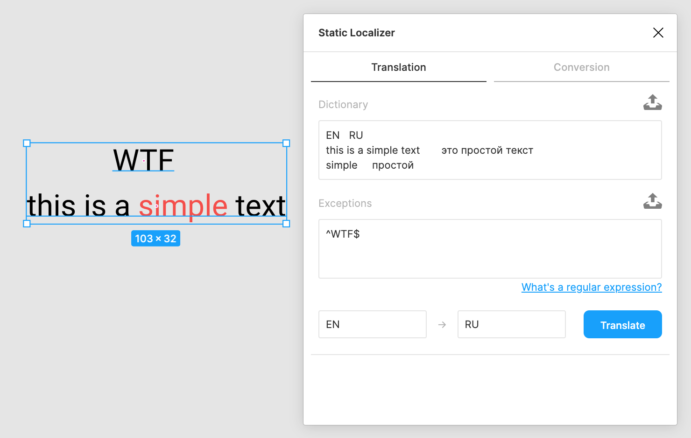
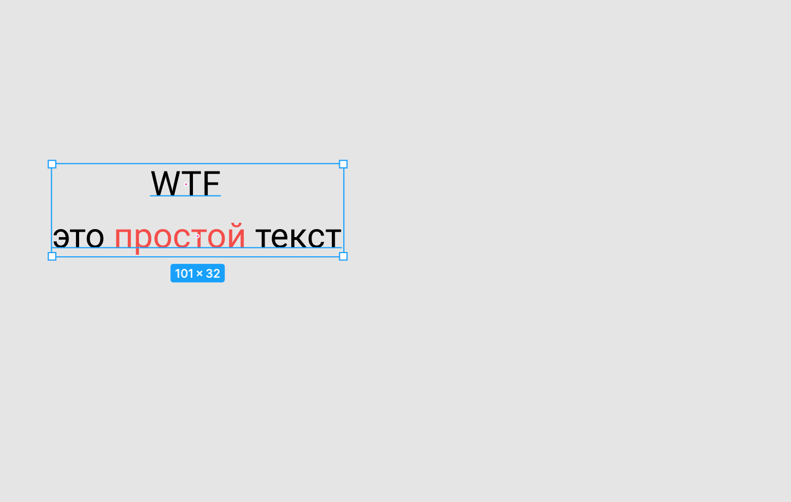
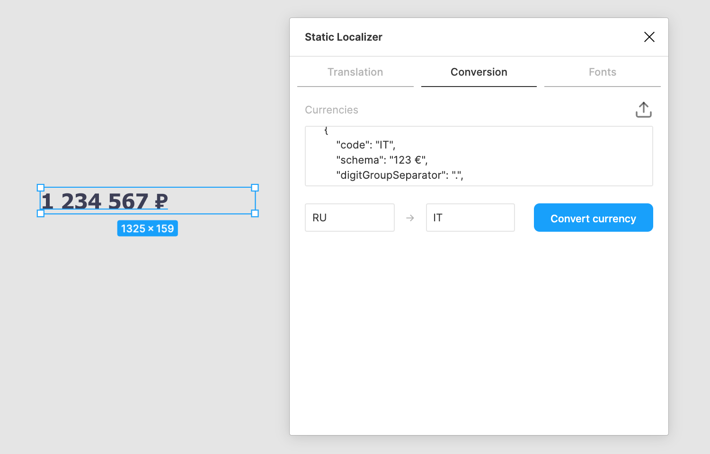
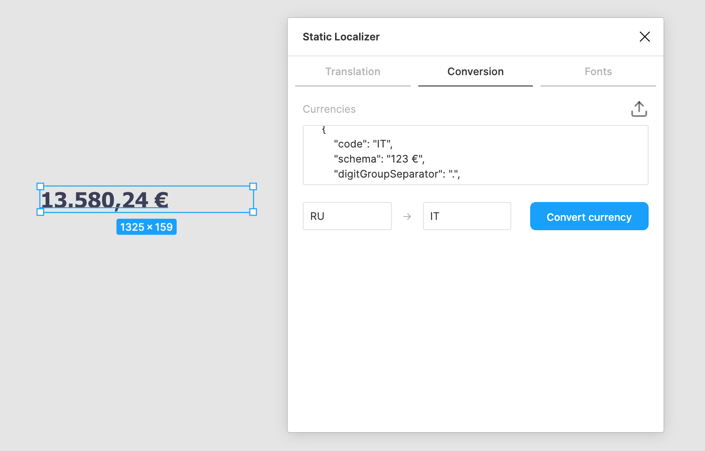
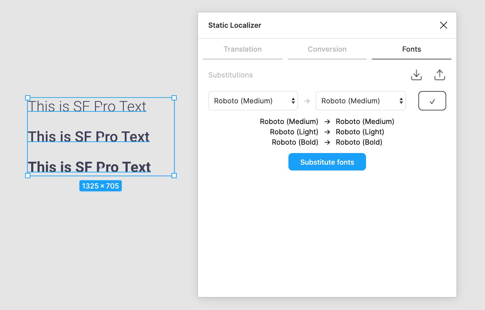

# Static Localizer

A Figma plugin that allows you to localize your content using a static dictionary.

Unlike many other localization plugins, it
- gracefully handles mixed text formatting
- correctly renders RTL texts
- can perform currency conversion
- can perform font substitution

## Installation

To install the plugin locally, download this repo, then go to

    Plugins > Development > Create new plugin

in Figma Desktop, and select the downloaded `manifest.json` file.

## Usage

The plugin includes several modules:
- [Translation](#translation)
- [Currency conversion](#currency-conversion)
- [Font substitution](#font-substitution)

Note that the plugin will always remember the last used settings.

### Translation

- Select components to translate
- Invoke this plugin
- Specify a [dictionary](#dictionary) explicitly or load it from a file
- Specify [exceptions](#exceptions) explicitly or load them from a file
- Specify source and target languages
- Mark the target language as RTL if needed
- Hit `Translate`




#### Dictionary

Should be in the [TSV](https://en.wikipedia.org/wiki/Tab-separated_values) format.
The first row is a header containing language codes.
Each of the following rows contains translations of some phrase into corresponding languages.

For instance,
```
RU	EN	DE
Привет!	Hello!	Hallo!
день	day	Tag
```

#### Exceptions

Define patterns to ignore during translation.
There should be one regular expression per line.

For instance,
```
^$
^-?[0-9. ]+%?$
```

Here are some commonly used patterns:

| Pattern | Description |
| - | - |
| `^$` | an empty text |
| `^\s*$` | whitespaces |
| `^[+-]?[0-9.,]+%?` | decimal numbers and percentages |
| `^Joom$` | some brand name |

Also, check out this [tutorial on regular expressions](https://medium.com/factory-mind/regex-tutorial-a-simple-cheatsheet-by-examples-649dc1c3f285).

#### Troubleshooting

If translation fails, you will see the list of untranslatable nodes right in the UI.
For each untranslatable node you will get
- a hyperlink to it
- a full error description

The plugin will then also suggest a list of phrases that should be translated in order to complete the translation.

You might get a `... does not fit into the box` error while translating into an RTL language
if your font doesn't have the required symbols.
Try [font substitution](#font-substitution) in this case.

### Currency conversion

- Select components to convert
- Invoke this plugin
- Go to the `Conversion` tab
- Specify a configuration for known currencies or load it from a file
- Specify source and target currency codes
- Hit `Convert currency`




Here is a sample configuration:

```json
[
    {
        "code": "RUB",
        "schema": "123 ₽",
        "digitGroupSeparator": " ",
        "decimalSeparator": "",
        "precision": 0,
        "rate": 1
    },
    {
        "code": "USD",
        "schema": "$123",
        "digitGroupSeparator": ",",
        "decimalSeparator": ".",
        "precision": 2,
        "rate": 0.013
    }
]
```

| Parameter | Example | Description |
| - | - | - |
| `code` | `USD` | a unique identifier |
| `schema` | `$123` | defines the appearance of a money value (`123` denotes the location of the numeric value) |
| `digitGroupSeparator` | `,` | used to separate thousands |
| `decimalSeparator` | `.` | used to separate the fraction |
| `precision` | `2` | the size of the fraction in digits |
| `rate` | `0.013` | the exchange rate to some fixed currency |

### Font substitution

- Select components to transform
- Invoke this plugin
- Go to the `Fonts` tab
- Configure a font mapping by picking font pairs and clicking the tick
- Hit `Substitute fonts`




You can download configured mappings and then load them later from a file.

## Development

Just follow this guide: https://www.figma.com/plugin-docs/setup/.

# License

**Static Localizer** is released under the MIT license.
