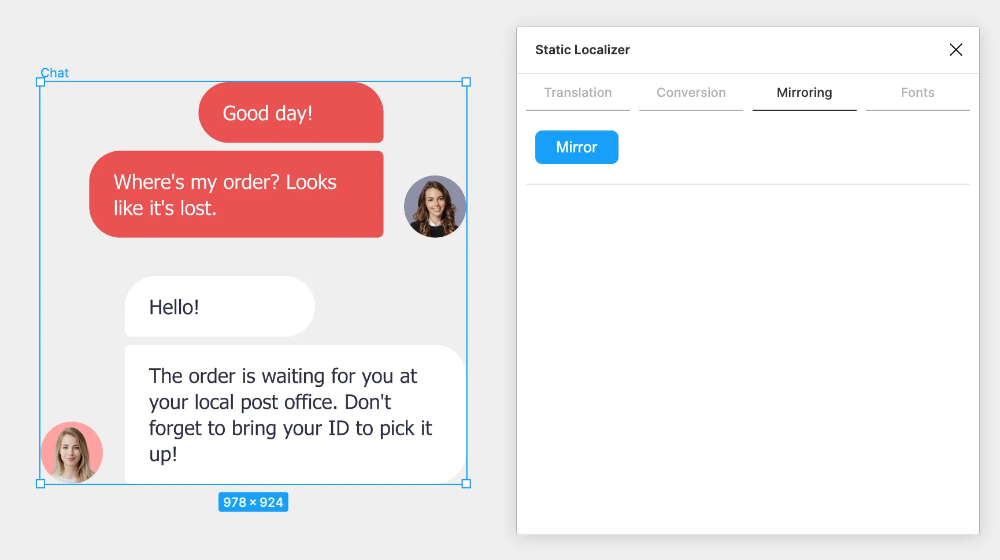
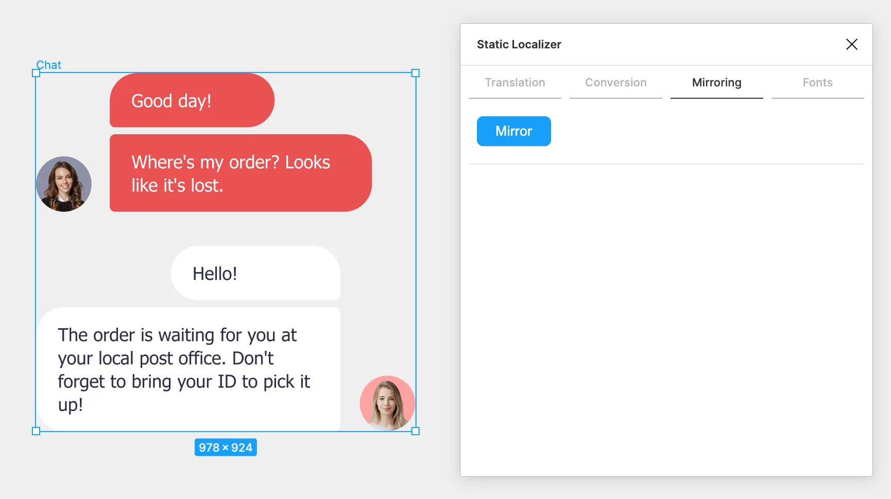

# Static Localizer

A Figma plugin that allows you to localize your content using a static dictionary.

Unlike many other localization plugins, it
- gracefully handles mixed text formatting
- correctly renders RTL texts
- can mirror interfaces for RTL languages
- can perform currency conversion
- can perform font substitution

## Installation

[Install](https://www.figma.com/community/plugin/876934931929982678/Static-Localizer) this plugin from Figma Community.

## Usage

The plugin includes several modules:
- [Translation](#translation)
- [Currency conversion](#currency-conversion)
- [Mirroring](#mirroring)
- [Font substitution](#font-substitution)

Note that the plugin will always remember the last used settings.

### Translation

- Select nodes to translate
- Invoke this plugin
- Specify a [dictionary](#dictionary) explicitly or load it from a file
- Specify [exceptions](#exceptions) explicitly or load them from a file
- Specify source and target languages
- Mark the target language as RTL if needed
- Hit `Translate`


#### Dictionary

Should be in the [TSV](https://en.wikipedia.org/wiki/Tab-separated_values) format.
The first row is a header containing language codes.
Each of the following rows contains translations of some phrase into corresponding languages.

For instance,
```
RU	EN	DE
Привет!	Hello!	Hallo!
день	day	Tag
```

#### Exceptions

Define patterns to ignore during translation.
There should be one regular expression per line.

For instance,
```
^$
^-?[0-9. ]+%?$
```

Here are some commonly used patterns:

| Pattern | Description |
| - | - |
| `^$` | an empty text |
| `^\s*$` | whitespaces |
| `^[+-]?[0-9.,]+%?` | decimal numbers and percentages |
| `^Joom$` | some brand name |

Also, check out this [tutorial on regular expressions](https://medium.com/factory-mind/regex-tutorial-a-simple-cheatsheet-by-examples-649dc1c3f285).

#### Troubleshooting

If translation fails, you will see the list of untranslatable nodes right in the UI.
For each untranslatable node you will get
- a hyperlink to it
- a full error description

The plugin will then also suggest a list of phrases that should be translated in order to complete the translation.

You might get a `... does not fit into the box` error while translating into an RTL language
if your font doesn't have the required symbols.
Try [font substitution](#font-substitution) in this case.

### Currency conversion

- Select nodes to convert
- Invoke this plugin
- Go to the `Conversion` tab
- Specify a configuration for known currencies or load it from a file
- Specify source and target currency codes
- Hit `Convert currency`

It supports numeric ranges, e.g. `12.3 - 456.7`.


Here is a sample configuration:

```json
[
    {
        "code": "RU",
        "schema": "123 ₽",
        "digitGroupSeparator": " ",
        "decimalSeparator": "",
        "precision": 0,
        "rate": 1
    },
    {
        "code": "US",
        "schema": "$123",
        "digitGroupSeparator": ",",
        "decimalSeparator": ".",
        "precision": 2,
        "rate": 0.013
    }
]
```

| Parameter | Example | Description |
| - | - | - |
| `code` | `US` | a unique identifier |
| `schema` | `$123` | defines the appearance of a money value (`123` denotes the location of the numeric value/range) |
| `digitGroupSeparator` | `,` | used to separate thousands |
| `decimalSeparator` | `.` | used to separate the fraction |
| `precision` | `2` | the size of the fraction in digits |
| `rate` | `0.013` | the exchange rate to some fixed currency |

### Mirroring

- Select nodes to mirror
- Invoke this plugin
- Go to the `Mirroring` tab
- Hit `Mirror`

Use this feature to adapt interfaces for RTL languages.

First, top-level nodes get mirrored horizontally, then all their descendant "atomic" nodes get mirrored back.
To treat a descendant frame/group as "atomic", simply lock it.
If you want some node to stay reflected after mirroring, do the following:
- reframe it to the boundaries of the host frame
- clone it
- reflect the clone to the left with respect to the left boundary of the host frame
- group the clone with the original node
- lock the resulting group

By altering the clone you can change the appearance of the node after mirroring in any way you need.




### Font substitution

- Select nodes to transform
- Invoke this plugin
- Go to the `Fonts` tab
- Configure a font mapping by picking font pairs and clicking the tick
- Hit `Substitute fonts`


You can download configured mappings and then load them later from a file.

## Development

Just follow this guide: https://www.figma.com/plugin-docs/setup/.

# License

**Static Localizer** is released under the MIT license.

# FAQ

#### Can I translate *from* an RTL language?

No, currently this option is not supported. Moreover, it doesn't seem feasible due to error-prone word wrapping.

#### How do I edit the dictionary?

The dictionary field is not meant to be edited in-place but rather used as an upload point.
Hence there is no download button.
For now, we suggest you to create a table in, say, Google Sheets, and then export it as a TSV.

#### I got an error but no text got translated at all. Why?

The plugin makes sure the translation can be correctly performed first.
So, if it finds any problems, no actual transformation is applied to the document.

#### How do I translate back quickly?

We recommend to use `Cmd+Z` to revert changes made by the plugin.
As simple as that.
One plugin invocation counts as a single action in Figma, which makes such rollbacks pretty safe and reliable.

#### Why a text node containing spaces only cannot be translated?

We trim spaces when we load a dictionary, so your phrase consisting of spaces only will degenerate into a blank line.
Besides, we pre-process text node contents before translation: join lines and collapse repeating spaces.
This may also cause deviations from what is in the dictionary.

#### How do I treat multi-line texts?

If you have line breaks within a sentence that you'd like to preserve - there is simply no way to make it work universally.
In other languages the order of words may change significantly.
But if you have separate paragraph, we highly recommend you to split it into a couple of independent text nodes and group them into an auto-layout.
First, this approach will give you more flexibility in general.
And second, you will be able to translate each paragraph as a separate line of text.

#### What if some phrase has different translations depending on the context?

Currently, the solution is cumbersome.
You can put several [word joiners](https://symbl.cc/en/#2060) after the phrase in both the document and the dictionary.
These characters are hidden, so you'll end up with a phrase that differs from the original one, but looks exactly the same.
Just add a different translation for the new phrase.
